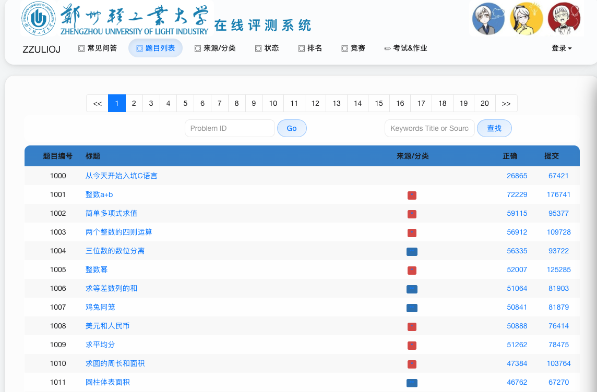
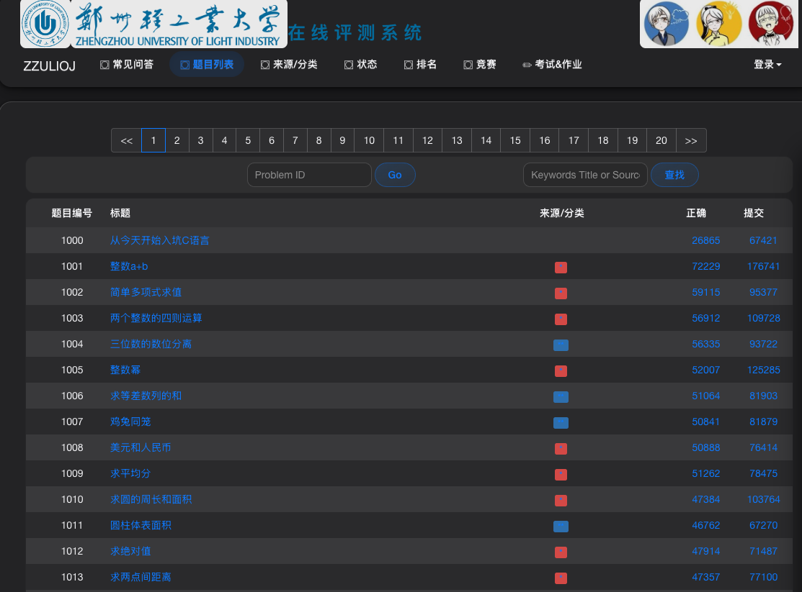

# ZZULIOJ iOS Style

这是一个用户脚本，旨在将郑州轻工业大学（ZZULIOJ）在线判题系统的旧版界面，现代化改造为类似 iOS 的扁平、圆角和半透明风格。脚本不仅美化了整体视觉，还增加了对深色模式的全面支持，并提供了便捷的控制选项。

## ✨ 功能特性

- **现代 iOS 风格设计**: 全面覆盖网站的 CSS 样式，带来干净、现代化的视觉体验，包括圆角、阴影和半透明的“玻璃拟态”效果。
- **深色模式**: 支持完整的手动或自动深色模式切换，有效减少夜间使用的视觉疲劳。
- **自动主题**: 可根据您的操作系统偏好（浅色/深色）自动切换主题。
- **便捷控制面板**: 在页面右下角提供一个悬浮控制面板，可以一键：
    - 启用或禁用 iOS 主题
    - 手动切换浅色/深色模式
    - 开启或关闭“跟随系统”模式
- **题目详情页增强**: 重新设计了题目详情页的头部，将题目信息（如时间/内存限制、提交/解决数）以更清晰的“胶囊”样式展示，并美化了提交和查看状态按钮。
- **快捷键**: 使用 `Ctrl + Alt + I` (在 macOS 上为 `Cmd + Option + I`) 快速启用或禁用整个主题。
- **跨浏览器兼容**: 适用于所有支持用户脚本扩展的现代浏览器（如 Chrome, Firefox, Edge, Safari）。

## 🚀 安装

1.  **安装用户脚本管理器**:
    您需要在浏览器中安装一个用户脚本管理器扩展。推荐使用 [**Tampermonkey**](https://www.tampermonkey.net/)，它支持所有主流浏览器。

2.  **安装本脚本**:
    - **选项一: 从 Greasy Fork 或 OpenUserJS 安装 (推荐)**
      *未来您可以将脚本发布到这些平台，并在此处提供链接。*

    - **选项二: 手动安装**
      1.  打开 Tampermonkey 的管理面板。
      2.  点击“+”号标签页创建一个新脚本。
      3.  将 `zzuliOJ-IOS.js` 文件的全部内容复制并粘贴到编辑器中，替换掉所有默认文本。
      4.  按下 `Ctrl + S` (或 `Cmd + S`) 保存脚本。

## 📖 使用说明

安装完成后，脚本将在您访问 `acm.zzuli.edu.cn` 域名下的任何页面时自动生效。

- **主题控制**:
  页面右下角会显示一个控制面板，您可以在此进行所有主题相关的设置。

- **快捷键**:
  随时随地使用 `Ctrl + Alt + I` (macOS: `Cmd + Option + I`) 来快速打开或关闭 iOS 美化风格。

## 📸 截图

*(您可以在此处添加脚本在浅色和深色模式下的效果截图)*

### 浅色模式

### 深色模式

## 👨‍💻 作者

- **ShiYi**

